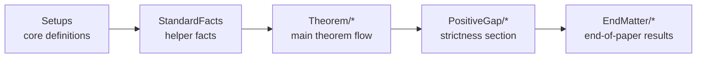

# Diamond Documentation Index

## Welcome

Lean is a programming language and theorem prover. In this repository, it is being used as a machine-checking assistant for mathematics rather than as a general application language. A **definition** in Lean introduces a new object, such as a norm, a class of maps, or a specific matrix construction. A **theorem** or **lemma** is a claim together with a formal proof that Lean checks block by block. A **proof** in Lean mixes ordinary mathematical content with short proof instructions, such as “rewrite using this identity” or “simplify this expression”. The crucial point is that Lean does not trust the author: every inference must be justified in a way the system can verify mechanically. That is why the code sometimes looks more explicit than a paper proof. The benefit is that once Lean accepts the file, the logical correctness of the formal proof has been checked all the way down.

## How to Read This Repository

The project follows the same order as the mathematical paper. Start with `Setups.lean`, where the main objects and norms are defined. Then read `StandardFacts.lean`, which collects helper lemmas and proved background reductions used later in the development. The folder `Theorem/*` contains the central proof flow: three preparatory lemmas, the main theorem, and a generalizing remark. The folder `PositiveGap/*` continues the story by showing that the main bound is strict in finite dimension. Finally, `EndMatter/*` contains the lower-bound constructions and the coding-theoretic consequence at the end of the paper. Every linked page below gives a beginner-facing, block-by-block guide to one declaration, so you can move back and forth between the formal code and the mathematical meaning.

## Lean Notation Primer

- `def`: introduces a new definition; read it as “define this object to be ...”.
- `abbrev`: introduces a shorter alias for an existing expression.
- `theorem`: states and proves a theorem.
- `lemma`: states and proves a supporting theorem; mathematically it is just another theorem.
- `namespace`: groups declarations under a shared prefix, here mostly `Diamond`.
- `section`: opens a local block of declarations and assumptions.
- `noncomputable`: warns that the declaration uses classical or abstract objects not meant to be executed as an algorithm.
- `open scoped`: turns on notational conventions from a named scope, such as matrix tensor notation.
- `:=`: means “is defined to be”.
- `→ₗ[ℂ]`: means “complex-linear map”.
- `[Fintype d]`: assumes the index type `d` is finite.
- `[DecidableEq d]`: assumes Lean can decide whether two elements of `d` are equal.
- `by`: starts a proof script.
- `simp`: simplifies an expression automatically.
- `rw`: rewrites using an equality.
- `calc`: starts a chain of equalities or inequalities.
- `ext`: proves two functions or matrices are equal by comparing outputs or entries.
- `rfl`: proves something by reflexivity.
- `have`: introduces an intermediate claim.
- `let`: introduces a temporary name.
- `show`: changes the goal to an equivalent but more convenient form.
- `exact`: supplies the exact proof term that closes the goal.
- `intro`: introduces a variable or assumption.
- `apply`: applies a theorem, replacing the goal by its hypotheses.
- `refine`: like `apply`, but with more control over the shape of the proof term.

## Glossary of Project-Specific Mathematics

- **operator**: a square complex matrix acting on a finite-dimensional Hilbert space.
- **channel**: a linear map on operators, intended to model a quantum channel or related transformation.
- **density state**: a positive semidefinite matrix of trace one.
- **trace norm**: the sum of singular values, usually written $\|X\|_1$.
- **Hilbert--Schmidt norm**: the Frobenius norm, usually written $\|X\|_2$.
- **partial transpose**: transpose applied on one tensor factor and identity on the other.
- **partial trace**: trace taken over one tensor factor of a bipartite operator.
- **diamond norm**: the stabilized trace norm of a linear map, defined by allowing an ancilla.
- **swap operator**: the operator $F$ that exchanges the two tensor factors.
- **vectorization**: turning a matrix into a vector by stacking entries in a fixed order.
- **Kraus operators**: matrices $E_k$ satisfying $T(X)=\sum_k E_k X E_k^\dagger$ for a quantum channel.
- **maximally entangled state**: the standard bipartite state $|\Omega_d\rangle = d^{-1/2}\sum_j |j\rangle\otimes|j\rangle$.

## Declaration Index

### `Setups.lean`

This file contains foundational objects and notational definitions for operators, channels, norms, and the maps studied in the paper.
- [`Operator`](Setups/Operator.md)
- [`Channel`](Setups/Channel.md)
- [`hsNorm`](Setups/hsNorm.md)
- [`traceNorm`](Setups/traceNorm.md)
- [`traceNormOp`](Setups/traceNormOp.md)
- [`hsNormOp`](Setups/hsNormOp.md)
- [`IsDensityState`](Setups/IsDensityState.md)
- [`DensityState`](Setups/DensityState.md)
- [`IsHermiticityPreserving`](Setups/IsHermiticityPreserving.md)
- [`IsQuantumChannel`](Setups/IsQuantumChannel.md)
- [`IsTraceAnnihilating`](Setups/IsTraceAnnihilating.md)
- [`transposeMap`](Setups/transposeMap.md)
- [`tensorWithIdentity`](Setups/tensorWithIdentity.md)
- [`partialTransposeMap`](Setups/partialTransposeMap.md)
- [`diamondNorm`](Setups/diamondNorm.md)
- [`diamondNormAt`](Setups/diamondNormAt.md)
- [`diamondOp`](Setups/diamondOp.md)
- [`partialTraceLeft`](Setups/partialTraceLeft.md)
- [`idMinus`](Setups/idMinus.md)
- [`adMap`](Setups/adMap.md)
- [`Ud`](Setups/Ud.md)
- [`Lambda`](Setups/Lambda.md)

### `StandardFacts.lean`

This file contains helper facts and proved background reductions used throughout the later arguments.
- [`trNorm_nonneg`](StandardFacts/trNorm_nonneg.md)
- [`hsNorm_nonneg`](StandardFacts/hsNorm_nonneg.md)
- [`hsNormOp_eq_zero_iff`](StandardFacts/hsNormOp_eq_zero_iff.md)
- [`quantumChannel_has_kraus`](StandardFacts/quantumChannel_has_kraus.md)
- [`tensorWithIdentity_comp_transpose`](StandardFacts/tensorWithIdentity_comp_transpose.md)
- [`idMinus_isHermiticityPreserving`](StandardFacts/idMinus_isHermiticityPreserving.md)
- [`idMinus_isTraceAnnihilating`](StandardFacts/idMinus_isTraceAnnihilating.md)
- [`adMap_isQuantumChannel`](StandardFacts/adMap_isQuantumChannel.md)
- [`diamond_le_of_pointwise`](StandardFacts/diamond_le_of_pointwise.md)
- [`diamond_le_of_pointwise_nonempty`](StandardFacts/diamond_le_of_pointwise_nonempty.md)
- [`traceNorm_apply_le_diamond`](StandardFacts/traceNorm_apply_le_diamond.md)
- [`lemma_transpose_diamond`](StandardFacts/lemma_transpose_diamond.md)
- [`unitary_channel_diamond_distance_eq_two_of_trace_zero`](StandardFacts/unitary_channel_diamond_distance_eq_two_of_trace_zero.md)
- [`trace_Ud_eq_zero`](StandardFacts/trace_Ud_eq_zero.md)
- [`exists_maximizing_state`](StandardFacts/exists_maximizing_state.md)
- [`asymptotic_cotangent_lower_bound`](StandardFacts/asymptotic_cotangent_lower_bound.md)
- [`trace_eq_trace_partialTraceLeft`](StandardFacts/trace_eq_trace_partialTraceLeft.md)
- [`partialTraceLeft_tensor_zero`](StandardFacts/partialTraceLeft_tensor_zero.md)
- [`tensorWithIdentity_trace_zero`](StandardFacts/tensorWithIdentity_trace_zero.md)
- [`tensorWithIdentity_hermitian`](StandardFacts/tensorWithIdentity_hermitian.md)
- [`sqrt_card_prod_self`](StandardFacts/sqrt_card_prod_self.md)

### `Theorem/Lemma1.lean`

This file contains the proof infrastructure for the first norm inequality and the public theorem `lemma1`.
- [`hsNorm_sq_eq_re_trace_conjTranspose_mul_self`](Theorem/Lemma1/hsNorm_sq_eq_re_trace_conjTranspose_mul_self.md)
- [`hermitian_re_trace_conjTranspose_mul_self_eq_sum_sq_eigenvalues`](Theorem/Lemma1/hermitian_re_trace_conjTranspose_mul_self_eq_sum_sq_eigenvalues.md)
- [`traceNormOp_mul_left_isometry`](Theorem/Lemma1/traceNormOp_mul_left_isometry.md)
- [`traceNormOp_diagonal`](Theorem/Lemma1/traceNormOp_diagonal.md)
- [`traceNormOp_conjTranspose`](Theorem/Lemma1/traceNormOp_conjTranspose.md)
- [`traceNormOp_mul_right_isometry`](Theorem/Lemma1/traceNormOp_mul_right_isometry.md)
- [`traceNormOp_hermitian_eq_sum_abs_eigenvalues`](Theorem/Lemma1/traceNormOp_hermitian_eq_sum_abs_eigenvalues.md)
- [`lemma1`](Theorem/Lemma1/lemma1.md)
- [`traceNormOp_posSemidef_eq_trace`](Theorem/Lemma1/traceNormOp_posSemidef_eq_trace.md)
- [`traceNormOp_density_eq_one`](Theorem/Lemma1/traceNormOp_density_eq_one.md)
- [`traceNormOp_sub_density_le_two`](Theorem/Lemma1/traceNormOp_sub_density_le_two.md)
- [`traceNormOp_eq_of_conjTranspose_mul_self_eq`](Theorem/Lemma1/traceNormOp_eq_of_conjTranspose_mul_self_eq.md)

### `Theorem/Lemma2.lean`

This file contains the Hilbert--Schmidt versus trace norm bound `lemma2`.
- [`hsNorm_sq_eq_re_trace_conjTranspose_mul_self`](Theorem/Lemma2/hsNorm_sq_eq_re_trace_conjTranspose_mul_self.md)
- [`lemma2`](Theorem/Lemma2/lemma2.md)

### `Theorem/Lemma3.lean`

This file contains the Hilbert--Schmidt invariance of partial transpose.
- [`lemma3`](Theorem/Lemma3/lemma3.md)

### `Theorem/Theorem1.lean`

This file contains the main strict submultiplicativity theorem for transpose composed with a channel difference.
- [`theorem1`](Theorem/Theorem1/theorem1.md)

### `Theorem/Remark1.lean`

This file contains the extension of Theorem 1 from channel differences to arbitrary Hermiticity-preserving, trace-annihilating maps.
- [`remark1`](Theorem/Remark1/remark1.md)

### `PositiveGap/Lemma4.lean`

This file contains the partial-trace identity for tensoring a quantum channel with the identity.
- [`lemma4`](PositiveGap/Lemma4/lemma4.md)

### `PositiveGap/Corollary1.lean`

This file contains the immediate zero-partial-trace consequence for `idMinus T`.
- [`corollary1`](PositiveGap/Corollary1/corollary1.md)

### `PositiveGap/Lemma5.lean`

This file contains the vectorization definition and its basic compatibility with Kronecker products.
- [`vecKet`](PositiveGap/Lemma5/vecKet.md)
- [`vecKet_apply`](PositiveGap/Lemma5/vecKet_apply.md)
- [`lemma5`](PositiveGap/Lemma5/lemma5.md)

### `PositiveGap/Lemma6.lean`

This file contains the swap operator and its algebraic interaction with tensor products.
- [`swapMatrix`](PositiveGap/Lemma6/swapMatrix.md)
- [`swapMatrix_mul_self`](PositiveGap/Lemma6/swapMatrix_mul_self.md)
- [`swapMatrix_conjTranspose`](PositiveGap/Lemma6/swapMatrix_conjTranspose.md)
- [`swapMatrix_conjTranspose_mul_self`](PositiveGap/Lemma6/swapMatrix_conjTranspose_mul_self.md)
- [`lemma6`](PositiveGap/Lemma6/lemma6.md)

### `PositiveGap/Lemma7.lean`

This file contains the partial-transpose formula for rank-one operators written in vectorized form.
- [`oneKronecker_mul_swap_apply`](PositiveGap/Lemma7/oneKronecker_mul_swap_apply.md)
- [`lemma7`](PositiveGap/Lemma7/lemma7.md)

### `PositiveGap/NotTight.lean`

This file contains the finite-dimensional non-tightness argument and the equality-case analysis behind it.
- [`sq_sum_expand_offDiag`](PositiveGap/NotTight/sq_sum_expand_offDiag.md)
- [`pairwise_zero_of_sum_sq_eq_sq_sum`](PositiveGap/NotTight/pairwise_zero_of_sum_sq_eq_sq_sum.md)
- [`existsUnique_nonzero_of_pairwise_zero`](PositiveGap/NotTight/existsUnique_nonzero_of_pairwise_zero.md)
- [`sum_sq_sub_avg_eq_aux`](PositiveGap/NotTight/sum_sq_sub_avg_eq_aux.md)
- [`sum_sq_sub_avg_eq`](PositiveGap/NotTight/sum_sq_sub_avg_eq.md)
- [`all_equal_of_sq_sum_eq_card_mul_sum_sq`](PositiveGap/NotTight/all_equal_of_sq_sum_eq_card_mul_sum_sq.md)
- [`lemma1_eq_imp_rank_two`](PositiveGap/NotTight/lemma1_eq_imp_rank_two.md)
- [`lemma2_eq_imp_full_rank`](PositiveGap/NotTight/lemma2_eq_imp_full_rank.md)
- [`partialTranspose_ne_zero_of_ne_zero`](PositiveGap/NotTight/partialTranspose_ne_zero_of_ne_zero.md)
- [`partialTranspose_rank_upper_bound`](PositiveGap/NotTight/partialTranspose_rank_upper_bound.md)
- [`theorem_not_tight`](PositiveGap/NotTight/theorem_not_tight.md)

### `EndMatter/Eq7.lean`

This file contains the explicit witness construction used to prove the lower bound labelled Eq. (7).
- [`omegaVec`](EndMatter/Eq7/omegaVec.md)
- [`phiState`](EndMatter/Eq7/phiState.md)
- [`inv_sqrt_mul_inv_sqrt`](EndMatter/Eq7/inv_sqrt_mul_inv_sqrt.md)
- [`phiState_trace`](EndMatter/Eq7/phiState_trace.md)
- [`phiState_isDensityState`](EndMatter/Eq7/phiState_isDensityState.md)
- [`phiState_apply`](EndMatter/Eq7/phiState_apply.md)
- [`transpose_phiState_eq_swap`](EndMatter/Eq7/transpose_phiState_eq_swap.md)
- [`swapMatrix_mul_phase_apply`](EndMatter/Eq7/swapMatrix_mul_phase_apply.md)
- [`transpose_ad_phiState_eq_swap_mul_phase`](EndMatter/Eq7/transpose_ad_phiState_eq_swap_mul_phase.md)
- [`lambda_phiState_eq`](EndMatter/Eq7/lambda_phiState_eq.md)
- [`theorem_eq7_witness_bound`](EndMatter/Eq7/theorem_eq7_witness_bound.md)
- [`theorem_eq7_witness_bound_explicit`](EndMatter/Eq7/theorem_eq7_witness_bound_explicit.md)
- [`ud_add_eq_mul`](EndMatter/Eq7/ud_add_eq_mul.md)
- [`ud_mul_star_self`](EndMatter/Eq7/ud_mul_star_self.md)
- [`ud_conjTranspose_mul_self`](EndMatter/Eq7/ud_conjTranspose_mul_self.md)
- [`ud_add_mul_star_eq`](EndMatter/Eq7/ud_add_mul_star_eq.md)
- [`swapMatrix_mul_diagonal_apply`](EndMatter/Eq7/swapMatrix_mul_diagonal_apply.md)
- [`explicit_witness_eq_swap_diagonal`](EndMatter/Eq7/explicit_witness_eq_swap_diagonal.md)
- [`explicit_witness_traceNorm_eq_sum`](EndMatter/Eq7/explicit_witness_traceNorm_eq_sum.md)
- [`norm_one_sub_ud_eq_sin`](EndMatter/Eq7/norm_one_sub_ud_eq_sin.md)
- [`shifted_sine_sum_eq_cot`](EndMatter/Eq7/shifted_sine_sum_eq_cot.md)
- [`norm_one_sub_ud_sum_eq_cot`](EndMatter/Eq7/norm_one_sub_ud_sum_eq_cot.md)
- [`explicit_witness_traceNorm_eq`](EndMatter/Eq7/explicit_witness_traceNorm_eq.md)
- [`theorem_eq7`](EndMatter/Eq7/theorem_eq7.md)

### `EndMatter/Eq8.lean`

This file contains the proof of Eq. (8) and the lower bound on the universal constant.
- [`theorem_eq8`](EndMatter/Eq8/theorem_eq8.md)
- [`alpha_lower_bound`](EndMatter/Eq8/alpha_lower_bound.md)

### `EndMatter/Corollary2.lean`

This file contains the coding-theoretic corollary stated in terms of encoder, decoder, and effective channel.
- [`Superoperator`](EndMatter/Corollary2/Superoperator.md)
- [`effectiveChannel`](EndMatter/Corollary2/effectiveChannel.md)
- [`corollary2_linear_bound`](EndMatter/Corollary2/corollary2_linear_bound.md)
- [`corollary2`](EndMatter/Corollary2/corollary2.md)
