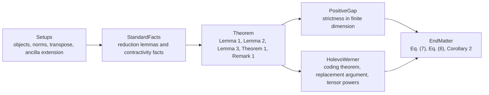

# Diamond Descriptions

## Overview

This directory is the reader-facing guide to the Lean formalization. Its job is not to
restate Lean syntax line by line. Its job is to explain, in ordinary mathematical language,
what each major part of the repository proves and how the pieces fit together.

The project formalizes the paper
_A dimension-independent strict submultiplicativity for the transposition map in diamond norm_.
The central estimate is

$$
\left\|\Theta \circ (\mathrm{id}-T)\right\|_\diamond
\le
\frac{1}{\sqrt{2}}\,
\|\Theta\|_\diamond\,
\|\mathrm{id}-T\|_\diamond,
$$

first for quantum channels \(T\), and then for arbitrary Hermiticity-preserving,
trace-annihilating maps.

## Recommended Reading Order

The formal development is easiest to read as a mathematical story:

## Module Overviews

- [`Setups/OVERVIEW.md`](Setups/OVERVIEW.md)
  Core objects:
  operators, channels, density states, transpose, partial transpose, ancilla extension,
  trace norm, Hilbert--Schmidt norm, and the paper's \(k=d\) diamond norm convention.

- [`StandardFacts/OVERVIEW.md`](StandardFacts/OVERVIEW.md)
  Background results:
  Kraus forms, pointwise-to-diamond reductions, Hermiticity and trace facts, contractivity,
  witness attainment, and the ancilla compression/expansion tools used later.

- [`Theorem/OVERVIEW.md`](Theorem/OVERVIEW.md)
  Main proof flow:
  Lemma 1, Lemma 2, Lemma 3, Theorem 1, and Remark 1.

- [`PositiveGap/OVERVIEW.md`](PositiveGap/OVERVIEW.md)
  Why the constant \(1/\sqrt{2}\) is not attained in finite dimension for nonzero channel
  differences.

- [`HolevoWerner/OVERVIEW.md`](HolevoWerner/OVERVIEW.md)
  The coding-theoretic layer:
  the original Holevo--Werner converse, the replacement argument, the improved converse,
  and the recursive tensor-power channel.

- [`EndMatter/OVERVIEW.md`](EndMatter/OVERVIEW.md)
  The end-of-paper consequences:
  Eq. (7), Eq. (8), the lower bound on the universal constant, and Corollary 2.

## Flagship Theorem Pages

These are the best pages to read if you want the mathematical core without diving into every
supporting declaration.

- [`Theorem/Theorem1/theorem1.md`](Theorem/Theorem1/theorem1.md)
  The main strict submultiplicativity theorem.

- [`Theorem/Remark1/remark1.md`](Theorem/Remark1/remark1.md)
  The extension from channel differences to arbitrary Hermiticity-preserving,
  trace-annihilating maps.

- [`PositiveGap/NotTight/theorem_not_tight.md`](PositiveGap/NotTight/theorem_not_tight.md)
  The finite-dimensional strictness statement.

- [`EndMatter/Eq7/theorem_eq7.md`](EndMatter/Eq7/theorem_eq7.md)
  The explicit lower bound
  $$
  2 \cot\!\left(\frac{\pi}{2d}\right) \le \|\Lambda_d\|_\diamond.
  $$

- [`EndMatter/Eq8/theorem_eq8.md`](EndMatter/Eq8/theorem_eq8.md)
  The exact unitary-channel distance formula
  $$
  \|\mathrm{id} - \mathrm{Ad}_{U_d}\|_\diamond = 2.
  $$

- [`EndMatter/Eq8/alpha_lower_bound.md`](EndMatter/Eq8/alpha_lower_bound.md)
  The lower bound on any dimension-independent constant:
  $$
  \frac{2}{\pi} \le \frac{1}{\sqrt{2}}.
  $$

- [`HolevoWerner/Theorem/diamondOp_transpose_tensorPowerChannel_le_pow.md`](HolevoWerner/Theorem/diamondOp_transpose_tensorPowerChannel_le_pow.md)
  The recursive middle-channel estimate
  $$
  \left\|\Theta \circ T^{\otimes m}\right\|_\diamond
  \le
  \left\|\Theta \circ T\right\|_\diamond^m
  $$
  for the concrete recursive tensor-power channel used in the code.

- [`HolevoWerner/Theorem/paper_holevo_werner_improved_converse_of_recursive_tensorPower.md`](HolevoWerner/Theorem/paper_holevo_werner_improved_converse_of_recursive_tensorPower.md)
  The improved Holevo--Werner converse in the form actually used by the final corollary.

- [`EndMatter/Corollary2/paper_corollary2.md`](EndMatter/Corollary2/paper_corollary2.md)
  The canonical paper-facing Corollary 2 theorem in the repository.

## Corollary 2 Proof Chain

The final coding statement is now formalized as a clean chain of ideas:

$$
\text{Theorem 1}
\Longrightarrow
\text{Remark 1}
\Longrightarrow
\text{replacement argument}
\Longrightarrow
\text{improved Holevo--Werner converse}
\Longrightarrow
\text{Corollary 2}.
$$

On the coding side, the last formerly external input is now internalized through the recursive
tensor-power bound

$$
\diamondOp\!\bigl(\Theta \circ T^{\otimes m}\bigr)
\le
\diamondOp\!\bigl(\Theta \circ T\bigr)^m,
$$

formalized in the repository for the concrete recursive object
`tensorPowerChannel T m`.

## About The Older Declaration Pages

The repository still contains many declaration-by-declaration pages for local lookup and source
navigation. Those pages are now secondary reference material. The recommended reading path is:

1. module overview,
2. flagship theorem page,
3. then the individual declaration page only if you need the exact Lean implementation details.
