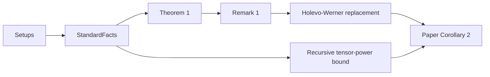

# Diamond Formalization

This site is the human-facing guide to the Lean formalization of
_A dimension-independent strict submultiplicativity for the transposition map in diamond norm_.

The mathematical core of the project is the estimate

$$
\left\|\Theta \circ (\mathrm{id}-T)\right\|_\diamond
\le
\frac{1}{\sqrt{2}}\,
\|\Theta\|_\diamond\,
\|\mathrm{id}-T\|_\diamond.
$$

The repository now also formalizes the finite-error coding consequence in a concrete recursive
form, using an actual Lean definition of the repeated-use channel \(T^{\otimes m}\).

## Reading Paths

### Quick Mathematical Route

1. [Theorem 1](Theorem/Theorem1/theorem1/)
2. [Remark 1](Theorem/Remark1/remark1/)
3. [Strictness in finite dimension](PositiveGap/NotTight/theorem_not_tight/)
4. [Eq. (7)](EndMatter/Eq7/theorem_eq7/)
5. [Eq. (8)](EndMatter/Eq8/theorem_eq8/)
6. [Paper Corollary 2](EndMatter/Corollary2/paper_corollary2/)

### Module Route

- [Setups overview](Setups/OVERVIEW/)
- [StandardFacts overview](StandardFacts/OVERVIEW/)
- [Theorem overview](Theorem/OVERVIEW/)
- [PositiveGap overview](PositiveGap/OVERVIEW/)
- [Holevo-Werner overview](HolevoWerner/OVERVIEW/)
- [EndMatter overview](EndMatter/OVERVIEW/)

## Proof Flow

## Canonical Final Theorem

The canonical endmatter entry point is
[paper_corollary2](EndMatter/Corollary2/paper_corollary2/).

It states that if a coding scheme using \(m\) copies of \(T\) has error

$$
\varepsilon
=
\frac12
\left\|
\mathrm{id}
- \mathcal D \circ T^{\otimes m} \circ \mathcal E
\right\|_\diamond
<
\frac{1}{\sqrt 2},
$$

then

$$
\frac{\log_2 d}{m}
\le
\log_2 \|\Theta \circ T\|_\diamond
+
\frac{1}{m}\log_2\!\left(\frac{1}{1-\sqrt{2}\varepsilon}\right).
$$

## Full Reference Index

For the complete declaration map, including the legacy reference pages, see
[DESCRIPTIONS/INDEX.md](INDEX/).
