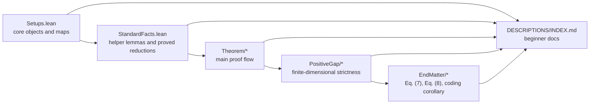

# Diamond

This repository is a Lean 4 + Mathlib formalization of the paper
_A dimension-independent strict submultiplicativity for the transposition map in diamond norm_.
It formalizes the transpose map, the relevant operator norms, the main strict submultiplicativity theorem,
the finite-dimensional non-tightness argument, and the end-matter lower-bound and coding consequences.

The central formal statement is the bound

$$
\|\Theta \circ (\mathrm{id} - T)\|_\diamond
\le \frac{1}{\sqrt{2}} \|\Theta\|_\diamond \|\mathrm{id} - T\|_\diamond
$$

for quantum channels $T$, together with its extension to Hermiticity-preserving,
trace-annihilating maps.

Original paper:
- arXiv: [2602.17748](https://arxiv.org/abs/2602.17748)

## What Is In This Repo

- Lean source: the formal development lives under [`Diamond/`](Diamond).
- Beginner-facing docs: the full declaration-by-declaration guide lives at
  [`DESCRIPTIONS/INDEX.md`](DESCRIPTIONS/INDEX.md).
- Paper source: a readable project note and paper draft live in [`docs/diamond.md`](docs/diamond.md)
  and [`docs/diamond.pdf`](docs/diamond.pdf).
- Build config: Lean / Mathlib configuration lives in [`lakefile.toml`](lakefile.toml)
  and [`lean-toolchain`](lean-toolchain).



## Main Formal Results

- `Diamond.Theorem.Theorem1.theorem1`
  proves the strict $1/\sqrt{2}$ submultiplicativity bound for $\Theta \circ (\mathrm{id} - T)$.
- `Diamond.Theorem.Remark1.remark1`
  proves the same bound for any Hermiticity-preserving, trace-annihilating map.
- `Diamond.PositiveGap.NotTight.theorem_not_tight`
  proves that the finite-dimensional bound is strict for nonzero channel differences.
- `Diamond.EndMatter.Eq7.theorem_eq7`
  proves the lower bound
  $$
  2 \cot\!\left(\frac{\pi}{2d}\right) \le \|\Lambda_d\|_\diamond.
  $$
- `Diamond.EndMatter.Eq8.theorem_eq8`
  proves
  $$
  \|\mathrm{id} - \mathrm{Ad}_{U_d}\|_\diamond = 2.
  $$
- `Diamond.EndMatter.Eq8.alpha_lower_bound`
  records the resulting lower-bound constraint on any universal constant:
  $$
  \frac{2}{\pi} \le \frac{1}{\sqrt{2}}.
  $$
- `Diamond.EndMatter.Corollary2.corollary2`
  formalizes the improved finite-error Holevo-Werner-style converse.

## Repository Layout

```text
Diamond/
├── Setups.lean
├── StandardFacts.lean
├── Theorem/
│   ├── Lemma1.lean
│   ├── Lemma2.lean
│   ├── Lemma3.lean
│   ├── Theorem1.lean
│   └── Remark1.lean
├── PositiveGap/
│   ├── Lemma4.lean
│   ├── Corollary1.lean
│   ├── Lemma5.lean
│   ├── Lemma6.lean
│   ├── Lemma7.lean
│   └── NotTight.lean
└── EndMatter/
    ├── Eq7.lean
    ├── Eq8.lean
    └── Corollary2.lean
```

Read the development in that same order:

1. `Setups.lean`
   introduces operators, channels, norms, partial transpose, partial trace, and the special map `Lambda`.
2. `StandardFacts.lean`
   collects reusable background lemmas and the finite-dimensional reductions used later in the file.
3. `Theorem/*`
   proves the three matrix-norm lemmas and then the main theorem.
4. `PositiveGap/*`
   proves the finite-dimensional strictness result.
5. `EndMatter/*`
   proves the explicit lower-bound witness, the unitary-channel distance formula, and the coding corollary.

## Build

This project uses Lean `v4.29.0-rc4` and Mathlib, as specified in [`lean-toolchain`](lean-toolchain)
and [`lakefile.toml`](lakefile.toml).

Typical local workflow:

```bash
lake build
```

To check a single file:

```bash
lake env lean Diamond/Theorem/Theorem1.lean
```

The root module [`Diamond.lean`](Diamond.lean) imports the development in paper order.

## Where To Start Reading

If you already know the mathematics and want the shortest route through the code:

1. [`Diamond/Theorem/Theorem1.lean`](Diamond/Theorem/Theorem1.lean)
2. [`Diamond/PositiveGap/NotTight.lean`](Diamond/PositiveGap/NotTight.lean)
3. [`Diamond/EndMatter/Eq7.lean`](Diamond/EndMatter/Eq7.lean)
4. [`Diamond/EndMatter/Eq8.lean`](Diamond/EndMatter/Eq8.lean)
5. [`Diamond/EndMatter/Corollary2.lean`](Diamond/EndMatter/Corollary2.lean)

If you are new to Lean, start with the beginner docs:

- [`DESCRIPTIONS/INDEX.md`](DESCRIPTIONS/INDEX.md)

That index explains Lean syntax, the mathematical objects in the project, and links to one page
per important declaration with block-by-block explanations.

## Self-Contained Status

The repository is now self-contained at the project level.

- There are no custom `axiom` declarations left in the Lean source under [`Diamond/`](Diamond).
- There are no `sorry` placeholders left in the project sources.
- [`Diamond/StandardFacts.lean`](Diamond/StandardFacts.lean) now contains proved helper lemmas and
  background reductions rather than assumed external facts.

The development still produces some linter and deprecation warnings, but the mathematical argument
formalized in the repository no longer depends on project-local axioms.

## Documentation Status

The repository now includes a full Markdown documentation tree under [`DESCRIPTIONS/`](DESCRIPTIONS),
with:

- a master index at [`DESCRIPTIONS/INDEX.md`](DESCRIPTIONS/INDEX.md)
- one page per important top-level declaration
- backlinks and dependency pointers between declarations
- beginner-oriented explanations of common Lean notation and proof tactics

## License / Usage

The formalization follows the original paper. The license and authorship rights belong to the author(s)
of the paper and to SNU CML.
