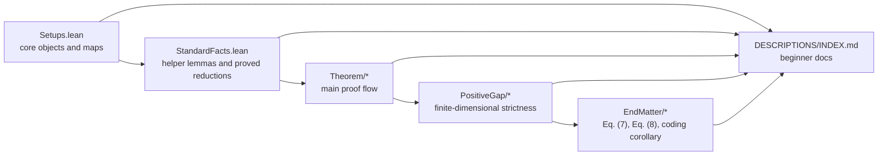

# Diamond

This repository is a Lean 4 + Mathlib formalization of the paper
_A dimension-independent strict submultiplicativity for the transposition map in diamond norm_.
It formalizes the transpose map, the relevant operator norms, the main strict submultiplicativity theorem,
the finite-dimensional non-tightness argument, and the end-matter lower-bound and coding consequences.

The central formal statement is the bound

$$
\|\Theta \circ (\mathrm{id} - T)\|_\diamond
\le \frac{1}{\sqrt{2}} \|\Theta\|_\diamond \|\mathrm{id} - T\|_\diamond
$$

for quantum channels $T$, together with its extension to Hermiticity-preserving,
trace-annihilating maps.

Original paper:
- arXiv: [2602.17748](https://arxiv.org/abs/2602.17748)

## What Is In This Repo

- Lean source: the formal development lives under [`Diamond/`](Diamond).
- Beginner-facing docs: the full declaration-by-declaration guide lives at
  [`DESCRIPTIONS/INDEX.md`](DESCRIPTIONS/INDEX.md).
- Paper source: a readable project note and paper draft live in [`docs/diamond.md`](docs/diamond.md)
  and [`docs/diamond.pdf`](docs/diamond.pdf).
- Build config: Lean / Mathlib configuration lives in [`lakefile.toml`](lakefile.toml)
  and [`lean-toolchain`](lean-toolchain).



## Main Formal Results

- `Diamond.Theorem.Theorem1.theorem1`
  proves the strict $1/\sqrt{2}$ submultiplicativity bound for $\Theta \circ (\mathrm{id} - T)$.
- `Diamond.Theorem.Remark1.remark1`
  proves the same bound for any Hermiticity-preserving, trace-annihilating map.
- `Diamond.PositiveGap.NotTight.theorem_not_tight`
  proves that the finite-dimensional bound is strict for nonzero channel differences.
- `Diamond.HolevoWerner.Theorem.paper_holevo_werner_original_converse`
  formalizes the original finite-error Holevo-Werner converse at the level of the
  effective channel.
- `Diamond.HolevoWerner.Theorem.paper_holevo_werner_replacement_argument`
  isolates the exact replacement step used in the paper: any improved bound on the
  transposed error term feeds directly into the same Holevo-Werner proof.
- `Diamond.HolevoWerner.Theorem.paper_holevo_werner_improved_converse`
  formalizes the improved finite-error Holevo-Werner converse obtained by plugging
  `Remark 1` into that replacement step.
- `Diamond.EndMatter.Eq7.theorem_eq7`
  proves the lower bound
  $$
  2 \cot\!\left(\frac{\pi}{2d}\right) \le \|\Lambda_d\|_\diamond.
  $$
- `Diamond.EndMatter.Eq8.theorem_eq8`
  proves
  $$
  \|\mathrm{id} - \mathrm{Ad}_{U_d}\|_\diamond = 2.
  $$
- `Diamond.EndMatter.Eq8.alpha_lower_bound`
  records the resulting lower-bound constraint on any universal constant:
  $$
  \frac{2}{\pi} \le \frac{1}{\sqrt{2}}.
  $$
- `Diamond.EndMatter.Corollary2.corollary2_of_quantum_coding_scheme`
  packages the paper's final finite-error refinement on top of the explicit
  Holevo-Werner theorem chain for a quantum coding scheme plus the remaining
  coding-side transpose bound recorded in
  `Diamond.HolevoWerner.CodingScheme.HolevoWernerCodeData`.
- `Diamond.EndMatter.Corollary2.corollary2_of_diamondOp_bound`
  is now the sharpest corollary-level entry point in the repo: it reduces the final
  coding-side input to the ordinary `diamondOp` bound on the transposed physical middle
  channel, with no remaining ancilla-cardinality split.
- `Diamond.EndMatter.Corollary2.corollary2_of_pure_state_bound`
  records the corresponding pure-state theorem-level frontier from which the ancilla
  compression and expansion arguments are derived.
- `Diamond.HolevoWerner.Theorem.paper_holevo_werner_improved_converse_of_pure_state_bound`
  gives the matching paper-facing Holevo-Werner statement at that pure-state frontier.
- `Diamond.EndMatter.Corollary2.corollary2_of_diamondOp_bound_same_type`
  closes that remaining assumption in the literal same-type case `msg = phys`, where the
  fixed-ancilla bound is just the ordinary `diamondOp` bound.
- `Diamond.EndMatter.Corollary2.corollary2_of_diamondOp_bound_card_eq`
  extends that closure to any message type with
  `Fintype.card msg = Fintype.card phys`, using ancilla reindexing invariance of the
  fixed-ancilla norm.
- `Diamond.EndMatter.Corollary2.corollary2_of_diamondOp_bound_card_le`
  closes the large-ancilla case `Fintype.card phys ≤ Fintype.card msg` by compressing pure
  ancilla witnesses down to ancilla `phys` and transporting them through the middle channel.
- `Diamond.EndMatter.Corollary2.corollary2_of_diamondOp_bound_card_ge`
  closes the complementary small-ancilla case `Fintype.card msg ≤ Fintype.card phys` by
  expanding pure ancilla witnesses up to ancilla `phys` and using exact trace-norm
  preservation under isometric embedding.
- `Diamond.EndMatter.Corollary2.corollary2_of_tensorPower_diamondOp_bound`
  is the sharpest explicit coding-scheme wrapper: from encoder, decoder, `tensorPower`,
  and the ordinary `diamondOp` bound on the transposed physical middle channel, it derives
  the paper’s finite-error converse with no remaining ancilla-cardinality split.
- `Diamond.EndMatter.Corollary2.corollary2_of_block_tensorPower_diamondOp_bound`
  is the sharpest paper-facing wrapper currently in the repo: it allows encoder, decoder,
  and the `m`-use physical middle channel to live on an arbitrary block space, while the
  converse rate is controlled by a single-use base channel `T`.
- `Diamond.HolevoWerner.TensorPower.tensorPowerChannel`
  now provides a concrete recursive `m`-use channel object, and
  `Diamond.HolevoWerner.Theorem.diamondOp_transpose_tensorPowerChannel_le_pow`
  proves the ordinary `diamondOp` bound for its transposed recursive middle channel. On top
  of that,
  `Diamond.EndMatter.Corollary2.corollary2_of_recursive_tensorPower`
  and
  `Diamond.EndMatter.Corollary2.paper_corollary2`
  give the concrete recursive-tensor-power Corollary 2 statement with no remaining
  middle-channel `diamondOp` hypothesis.

## Repository Layout

```text
Diamond/
├── Setups.lean
├── StandardFacts.lean
├── Theorem/
│   ├── Lemma1.lean
│   ├── Lemma2.lean
│   ├── Lemma3.lean
│   ├── Theorem1.lean
│   └── Remark1.lean
├── PositiveGap/
│   ├── Lemma4.lean
│   ├── Corollary1.lean
│   ├── Lemma5.lean
│   ├── Lemma6.lean
│   ├── Lemma7.lean
│   └── NotTight.lean
├── HolevoWerner/
│   ├── Common.lean
│   ├── Basic.lean
│   ├── CodingScheme.lean
│   ├── ReplaceArgument.lean
│   ├── Theorem.lean
│   └── Original.lean
└── EndMatter/
    ├── Eq7.lean
    ├── Eq8.lean
    └── Corollary2.lean
```

Read the development in that same order:

1. `Setups.lean`
   introduces operators, channels, norms, partial transpose, partial trace, and the special map `Lambda`.
2. `StandardFacts.lean`
   collects reusable background lemmas and the finite-dimensional reductions used later in the file.
3. `Theorem/*`
   proves the three matrix-norm lemmas and then the main theorem.
4. `PositiveGap/*`
   proves the finite-dimensional strictness result.
5. `HolevoWerner/*`
   formalizes the finite-error Holevo-Werner converse, the replacement argument,
   and the packaged coding-scheme interface used by the endmatter corollary.
6. `EndMatter/*`
   proves the explicit lower-bound witness, the unitary-channel distance formula,
   and the final corollary wrappers.

## Build

This project uses Lean `v4.29.0-rc4` and Mathlib, as specified in [`lean-toolchain`](lean-toolchain)
and [`lakefile.toml`](lakefile.toml).

Typical local workflow:

```bash
lake build
```

To check a single file:

```bash
lake env lean Diamond/Theorem/Theorem1.lean
```

The root module [`Diamond.lean`](Diamond.lean) imports the development in paper order.

## Where To Start Reading

If you already know the mathematics and want the shortest route through the code:

1. [`Diamond/Theorem/Theorem1.lean`](Diamond/Theorem/Theorem1.lean)
2. [`Diamond/PositiveGap/NotTight.lean`](Diamond/PositiveGap/NotTight.lean)
3. [`Diamond/EndMatter/Eq7.lean`](Diamond/EndMatter/Eq7.lean)
4. [`Diamond/EndMatter/Eq8.lean`](Diamond/EndMatter/Eq8.lean)
5. [`Diamond/EndMatter/Corollary2.lean`](Diamond/EndMatter/Corollary2.lean)

If you are new to Lean, start with the beginner docs:

- [`DESCRIPTIONS/INDEX.md`](DESCRIPTIONS/INDEX.md)

That index now gives a math-first reading guide: module overviews, flagship theorem pages, and
only then the older declaration-level reference pages when you need exact source lookup.
The same `DESCRIPTIONS/` tree is now also set up as the GitHub Pages/Jekyll homepage used by the
documentation workflow.

## Self-Contained Status

The repository is now self-contained at the project level.

- There are no custom `axiom` declarations left in the Lean source under [`Diamond/`](Diamond).
- There are no `sorry` placeholders left in the project sources.
- [`Diamond/StandardFacts.lean`](Diamond/StandardFacts.lean) now contains proved helper lemmas and
  background reductions rather than assumed external facts.
- [`Diamond/Setups.lean`](Diamond/Setups.lean) now takes the paper's `k = d`
  diamond-norm convention as the public definition `diamondNorm`, while keeping
  the all-ancilla supremum as a separate background definition.

The development still produces some linter and deprecation warnings, but the mathematical argument
formalized in the repository no longer depends on project-local axioms.

## Documentation Status

The repository now includes a full Markdown documentation tree under [`DESCRIPTIONS/`](DESCRIPTIONS),
with:

- a master index at [`DESCRIPTIONS/INDEX.md`](DESCRIPTIONS/INDEX.md)
- module-level overviews written in ordinary mathematical language
- flagship theorem pages with displayed formulas and proof architecture summaries
- legacy declaration-level pages retained as secondary lookup material
- a Jekyll site configuration so the same material can be published as a browsable docs site

## License / Usage

The formalization follows the original paper. The license and authorship rights belong to the author(s)
of the paper and to SNU CML.
