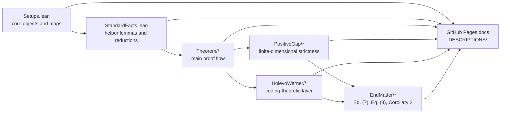

# Diamond

This repository is a Lean 4 + Mathlib formalization of the paper
_A dimension-independent strict submultiplicativity for the transposition map in diamond norm_.
It formalizes the transpose map, the relevant operator norms, the main strict
submultiplicativity theorem, the finite-dimensional non-tightness argument,
and the end-matter lower-bound and coding consequences.

The central formal statement is

$$
\|\Theta \circ (\mathrm{id} - T)\|_\diamond
\le
\frac{1}{\sqrt{2}}\, \|\Theta\|_\diamond \, \|\mathrm{id} - T\|_\diamond
$$

for quantum channels $T$, together with its extension to
Hermiticity-preserving, trace-annihilating maps.

- Original paper: [arXiv:2602.17748](https://arxiv.org/abs/2602.17748)
- Live documentation site: [aledo-jun.github.io/diamond](https://aledo-jun.github.io/diamond/)
- Docs publishing workflow: [`.github/workflows/lean_action_ci.yml`](.github/workflows/lean_action_ci.yml)

## Documentation Website

The repository includes a reader-facing documentation site built from
[`DESCRIPTIONS/`](DESCRIPTIONS/).

- Source tree: [`DESCRIPTIONS/`](DESCRIPTIONS/)
- Live site: <https://aledo-jun.github.io/diamond/>
- Publishing path: GitHub Actions builds and publishes the site through
  [`.github/workflows/lean_action_ci.yml`](.github/workflows/lean_action_ci.yml)
  using `leanprover/lean-action` and `leanprover-community/docgen-action`
  with `homepage: DESCRIPTIONS`.

If you are new to the project, the best entry points are:

- the live homepage: <https://aledo-jun.github.io/diamond/>
- the full index: <https://aledo-jun.github.io/diamond/INDEX/>
- the local source for that index: [`DESCRIPTIONS/INDEX.md`](DESCRIPTIONS/INDEX.md)

## Repository At A Glance

- Lean source: [`Diamond/`](Diamond)
- Root import module: [`Diamond.lean`](Diamond.lean)
- Beginner-facing docs source: [`DESCRIPTIONS/`](DESCRIPTIONS/)
- Paper note / draft: [`docs/diamond.md`](docs/diamond.md), [`docs/diamond.pdf`](docs/diamond.pdf)
- Build configuration: [`lakefile.toml`](lakefile.toml), [`lean-toolchain`](lean-toolchain)



## Main Formal Results

Some key declarations are:

- `Diamond.Theorem.Theorem1.theorem1`
  the strict $1/\sqrt{2}$ submultiplicativity bound for
  $\Theta \circ (\mathrm{id} - T)$.
- `Diamond.Theorem.Remark1.remark1`
  the extension to arbitrary Hermiticity-preserving,
  trace-annihilating maps.
- `Diamond.PositiveGap.NotTight.theorem_not_tight`
  the finite-dimensional strictness result.
- `Diamond.EndMatter.Eq7.theorem_eq7`
  the lower bound
  $$
  2 \cot\!\left(\frac{\pi}{2d}\right) \le \|\Lambda_d\|_\diamond.
  $$
- `Diamond.EndMatter.Eq8.theorem_eq8`
  the exact unitary-channel distance formula
  $$
  \|\mathrm{id} - \mathrm{Ad}_{U_d}\|_\diamond = 2.
  $$
- `Diamond.EndMatter.Corollary2.paper_corollary2`
  the paper-facing finite-error coding corollary for the recursive
  tensor-power channel.
- `Diamond.HolevoWerner.Theorem.diamondOp_transpose_tensorPowerChannel_le_pow`
  the recursive tensor-power middle-channel bound used in the final coding chain.

## Module Map

The root module [`Diamond.lean`](Diamond.lean) provides a single convenience import for the
full development.
At a high level:

- [`Diamond/Setups.lean`](Diamond/Setups.lean) defines channels, norms, transpose,
  ancilla extension, and the special end-matter maps.
- [`Diamond/StandardFacts.lean`](Diamond/StandardFacts.lean) proves reusable background
  lemmas and finite-dimensional reductions.
- [`Diamond/Theorem/`](Diamond/Theorem) contains the main proof flow:
  the three norm lemmas, the transpose-diamond computation, Theorem 1, and Remark 1.
- [`Diamond/PositiveGap/`](Diamond/PositiveGap) proves finite-dimensional strictness.
- [`Diamond/HolevoWerner/`](Diamond/HolevoWerner) formalizes the coding-theoretic layer,
  including the recursive tensor-power channel.
- [`Diamond/EndMatter/`](Diamond/EndMatter) contains Eq. (7), Eq. (8), and the final
  coding corollaries.

Recommended reading order:

1. `Diamond/Setups.lean`
2. `Diamond/StandardFacts.lean`
3. `Diamond/Theorem/*`
4. `Diamond/PositiveGap/*`
5. `Diamond/HolevoWerner/*`
6. `Diamond/EndMatter/*`

## Build

This project uses Lean `v4.29.0-rc4` and Mathlib, as specified in
[`lean-toolchain`](lean-toolchain) and [`lakefile.toml`](lakefile.toml).

Build the whole project with:

```bash
lake build
```

Check a single file with:

```bash
lake env lean Diamond/Theorem/Theorem1.lean
```

## Where To Start Reading

If you want the shortest path through the mathematics and code, start with:

1. [`Diamond/Theorem/Theorem1.lean`](Diamond/Theorem/Theorem1.lean)
2. [`Diamond/PositiveGap/NotTight.lean`](Diamond/PositiveGap/NotTight.lean)
3. [`Diamond/EndMatter/Eq7.lean`](Diamond/EndMatter/Eq7.lean)
4. [`Diamond/EndMatter/Eq8.lean`](Diamond/EndMatter/Eq8.lean)
5. [`Diamond/EndMatter/Corollary2.lean`](Diamond/EndMatter/Corollary2.lean)

If you want the human-facing explanation first, use the docs site:

- <https://aledo-jun.github.io/diamond/>
- <https://aledo-jun.github.io/diamond/INDEX/>

## Self-Contained Status

The repository is self-contained at the project level in the sense that:

- no project-local `axiom` declarations remain under [`Diamond/`](Diamond),
- no `sorry` placeholders remain in the project sources,
- [`Diamond/StandardFacts.lean`](Diamond/StandardFacts.lean) contains proved helper lemmas and
  background reductions rather than assumed external facts.
- [`Diamond/Setups.lean`](Diamond/Setups.lean) exposes the paper's $k=d$ convention as the public
  definition `diamondNorm`, while keeping the all-ancilla supremum available as background.

The development may still emit some linter and deprecation warnings, but the core mathematical
argument no longer depends on project-local axioms.

## License / Usage

The formalization follows the original paper. The license and authorship rights belong to the
paper’s author(s) and to SNU CML.
